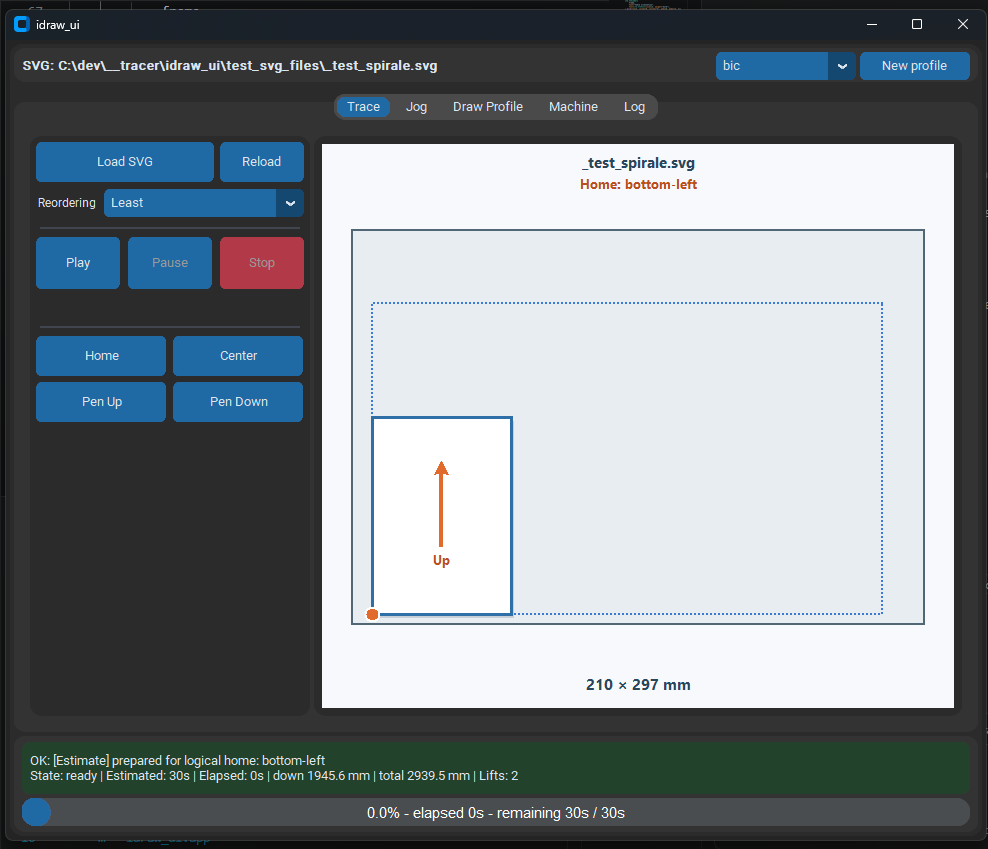
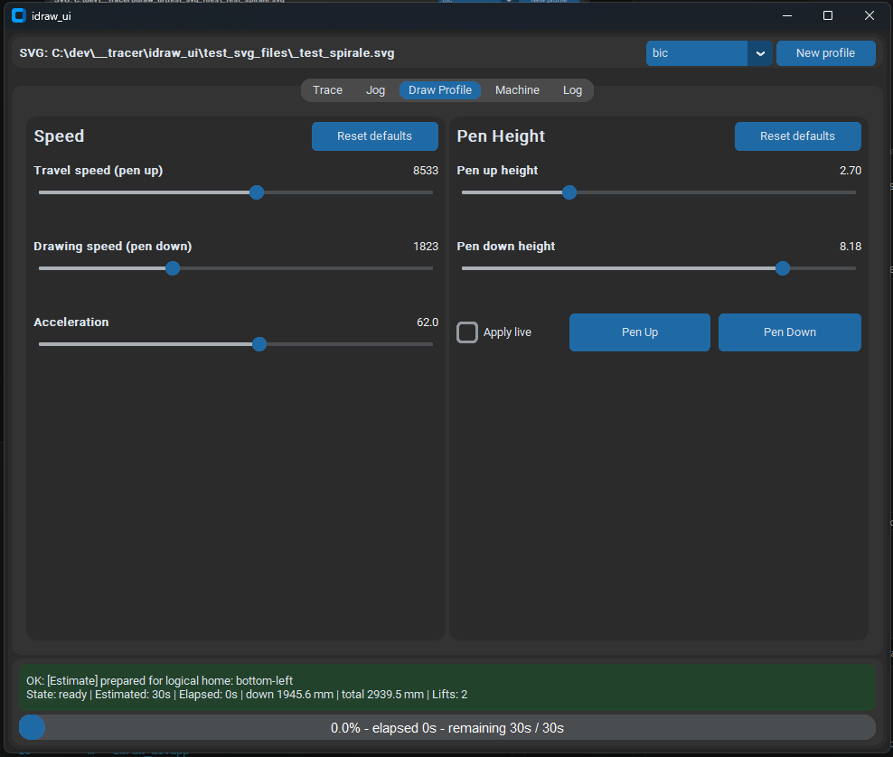
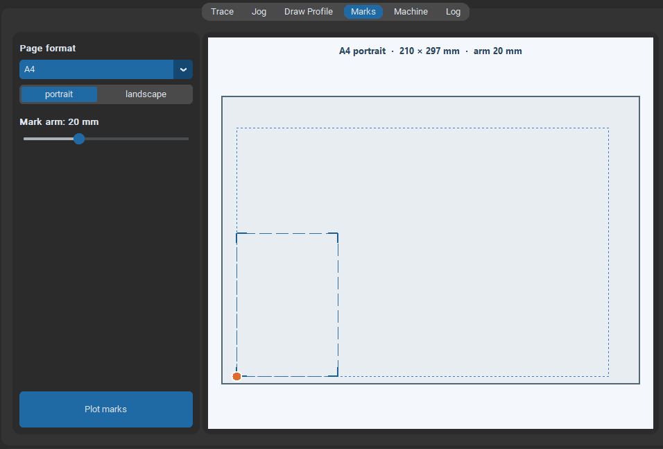
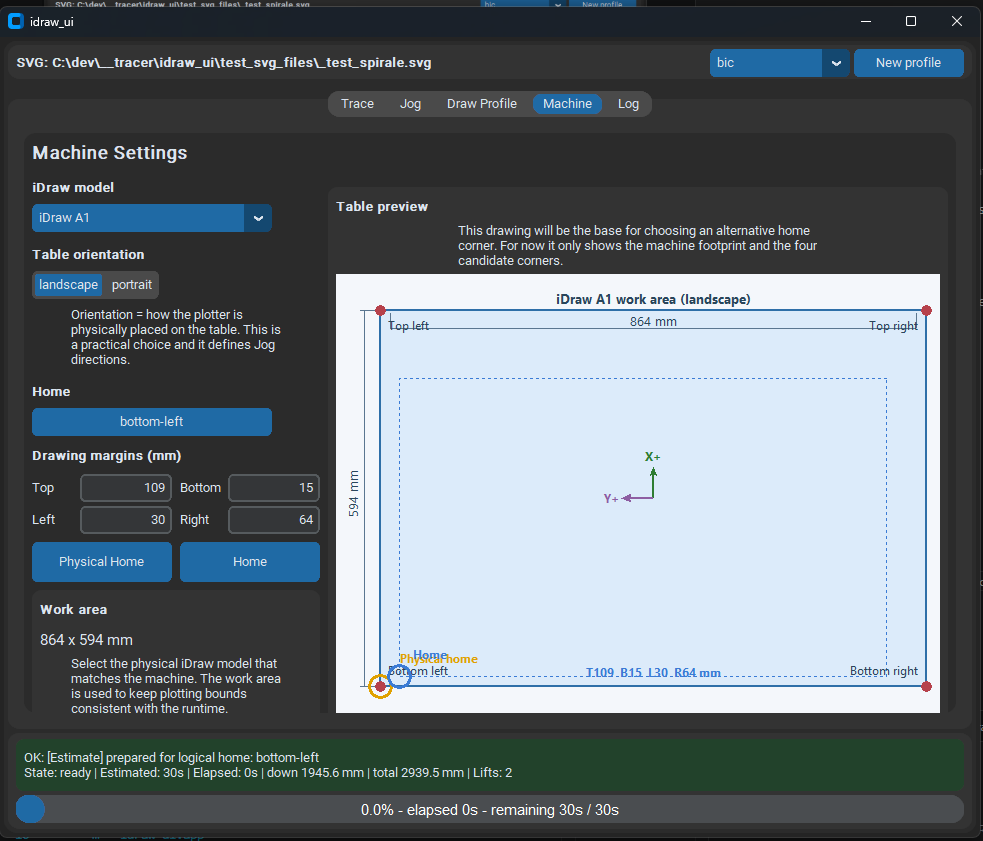

# idraw_ui

Desktop application for controlling iDraw plotters — load an SVG, configure
the pen and speed, choose a drawing zone, and plot.

---

## Installation

Download the latest release ZIP from the repository, unzip it anywhere, and
double-click **`idraw_ui.exe`** — no Python installation required.

> For developers who want to run from source or contribute, see
> [`docs/dev_setup.md`](docs/dev_setup.md).

---

## Interface overview

The window has five tabs across the top. The active SVG file and the current
draw profile are shown in the header bar at all times.

---

### Trace



The main operating page.

| Control | Description |
| --- | --- |
| **Load SVG** | Open an SVG file to plot. |
| **Reload** | Reload the last opened file (useful after editing it externally). |
| **Reordering** | Path optimisation level before plotting (Least / Basic / Full / None). |
| **Play** | Start plotting. Triggers a fast estimate first; the progress bar shows expected duration. |
| **Pause / Stop** | Interrupt the current plot. |
| **Resume** | Continue a paused plot from where it stopped. |

The physical pause button on the machine also pauses the plot mid-stroke. The application detects this and shows the **Resume** button — press it in the interface to continue. Pressing the physical button a second time does **not** resume; use **Resume** in the UI instead.
| **Home** | Raise the pen, home the machine to the physical limit switches, then move to the configured logical home corner. |
| **Center** | Move the carriage to the centre of the table. |
| **Pen Up / Pen Down** | Manually raise or lower the pen. |

The preview on the right shows where the SVG will be placed on the table, based
on the current machine, orientation, home corner, and drawing margins. If the
SVG does not fit inside the configured drawing area, **OUT OF BOUNDS** appears
beside the Play button and the preview outline turns red.

---

### Jog


Manual carriage control.

- **Home / Center** — same as the Trace shortcuts.
- **Jog mode** — switch between *physical* axes (+X/+Y) and *table-relative*
  directions (right/left/forward/backward). Use table mode if you are not sure
  which way the machine's axes point.
- **Arrow buttons / keyboard arrows** — move the carriage by the selected
  distance. Arrow keys on the keyboard work when this tab is active.
- **Jog distance slider** — step size per button press.

**Setting drawing margins from hardware**

This is the recommended way to define your drawing area:

1. Click **Home** — the position display resets to `0`.
2. Jog the carriage to the boundary you want to set (e.g. the top edge of your
   paper surface).
3. Click the matching **Set Top / Set Bottom / Set Left / Set Right** button.
   The margin is saved immediately and the preview updates.

---

### Draw Profile



Speed and pen height settings, saved in the active profile.

**Speed** (left column)

| Slider | Description |
| --- | --- |
| Travel speed (pen up) | How fast the carriage moves between strokes. |
| Drawing speed (pen down) | How fast the pen moves while drawing. |
| Acceleration | Motor ramp-up rate. |

**Pen Height** (right column)

| Control | Description |
| --- | --- |
| Pen up height | Z position when the pen is lifted (0 = fully down, 10 = fully up). |
| Pen down height | Z position when the pen is drawing. |
| Apply live | Apply slider changes immediately to the physical pen without re-plotting. |
| Pen Up / Pen Down | Test the current heights on the machine. |

Profiles are selected and created in the header bar. Each profile stores all
speed and pen values independently.

---

### Marks



Generate and plot registration marks so you can position your paper precisely on the table.

| Control | Description |
| --- | --- |
| **Page format** | Paper size to mark: A0–A6 or Raisin variants (Grand Raisin, Raisin, Demi-Raisin). |
| **Orientation** | Portrait or landscape for the selected format. |
| **Mark arm** | Length of each arm of the L-shaped corner mark (same in X and Y). |
| **Plot marks** | Generate the SVG, load it in the Trace tab, and estimate — click Play to plot. |

The preview shows the table, the drawing margin zone (dotted), and the page
positioned at the configured home corner. The four L-shaped marks are drawn to
scale in the preview. If the selected format does not fit inside the drawing area
the page outline turns red.

---

### Machine



One-time configuration that matches the application to your physical plotter.

| Setting | Description |
| --- | --- |
| **iDraw model** | Select the exact model — this defines the work area dimensions and axis directions. |
| **Table orientation** | How the plotter is physically placed on the table (landscape or portrait). This affects jog directions. |
| **Home** | Which corner of the table you want to use as the drawing anchor. |
| **Drawing margins** | Inset from each edge in mm — defines the usable drawing area inside the full work area. |
| **Physical Home** | Send the machine to its firmware limit-switch home. |
| **Home** | Move to the logical home corner (with margins applied). |

The table preview on the right shows the machine footprint, the drawing margin
boundary (dotted line), the physical home marker (orange), and the logical home
marker (blue). It updates live as you change any setting.

---

## Before first use — mandatory safety test

Run this procedure before plotting on any machine that has not been validated,
and again after changing the model, orientation, or axis configuration.

> Every **Home** and **Center** action raises the pen before moving. If the
> pen raise fails, the movement is aborted. Raise the pen manually and diagnose
> the pen command before retrying.

### Prepare

1. Clear the plotter area and keep access to the emergency stop or power switch.
2. Remove the pen (or make certain it stays raised) for the first dry run.
3. In **Machine**, select the exact model, orientation, and home corner.
4. Move the carriage by hand to the centre of the work area (motors off or
   machine powered down). Do not force a powered motor.
5. Power the machine back on.
6. In **Trace**, load `test_svg_files/_test_a6.svg`.
7. Check the preview: the home marker must match the chosen corner; the A6
   page must appear in the expected area; **OUT OF BOUNDS** must not be shown.

### Validate the home corner

Be ready to press **Stop** or cut power if the carriage heads the wrong way.

| Selected Home | Expected drawing direction from the centre |
| --- | --- |
| `top-left` | right and down |
| `top-right` | left and down |
| `bottom-left` | right and up |
| `bottom-right` | left and up |

1. Press **Play** and verify the first moves against this table.
2. Stop immediately if the direction is wrong or the carriage approaches a limit.
3. If the dry run is correct, install the pen and repeat on paper.
4. Confirm the page is in the expected zone, the `Up` arrow points toward the
   visual top of the table, and `A6 Test` is upright and not mirrored.
5. Repeat for every home corner you plan to use.

Do not plot for production if this test fails. A wrong direction means the
selected model does not match the physical machine.

---

## Advanced settings

A few low-level settings are not exposed in the UI and must be edited directly
in `settings/machine.yaml`.

```yaml
baudrate: 115200
digest: 1
port: null
serial_timeout: 1.0
```

| Key | Description |
| --- | --- |
| `port` | Serial port to use (`null` = auto-detect the first available iDraw device). |
| `baudrate` | Serial baud rate — leave at default unless debugging a hardware issue. |
| `serial_timeout` | Read timeout in seconds. |
| `digest` | `0` = disabled, `1` = normal (recommended), `2` = digest-only (no plotting). |

---

## Documentation

- Hardware observations and validated axis mapping: `docs/hardware_notes.md`
- Architecture, pipeline details, developer notes: `docs/developer_notes.md`

## Mandatory safety test before first use

Run this procedure before using the application with a machine that has not yet
been validated. Repeat it after adding or changing a machine model, its table
orientation, or its axis configuration.

This qualification reduces the risk of an incorrect move; it cannot guarantee
mechanical safety. Keep the machine supervised and remain ready to stop it during
every validation run.

Every application `Home`, `My home`, and `Center` action sends `Pen Up` before
starting the homing move. If raising the pen fails, the movement is aborted. Do
not bypass that failure: raise the pen manually with the machine stopped, then
diagnose the pen command before trying again.

### Prepare the test

1. Clear the whole plotter area and keep access to the emergency stop or power
	switch.
2. Remove the pen for the first dry run, or make certain that it stays fully
	raised.
3. In `Machine`, select the exact physical plotter model.
4. Select the physical table orientation and the desired `My home` corner.
5. With the motors disabled or the machine powered off, move the carriage by
	hand near the center of the usable area. Do not force a powered motor.
6. Power or enable the machine again without asking the application to perform
	a long positioning move.
7. In `Trace`, load `test_svg_files/_test_a6.svg`.
8. Check the preview before pressing `Play`:
	- the orange home marker must match the selected corner;
	- the A6 page must appear in the expected area of the table;
	- `OUT OF BOUNDS` must not be displayed.

### Validate the selected home

Start the test with the carriage near the center so there is at least one A6
page of free travel in every direction. Be ready to press `Stop` or cut power as
soon as the first move heads the wrong way.

The drawing must extend inward from the selected visual home:

| Selected `My home` | Expected drawing direction from the center |
| --- | --- |
| `top-left` | right and down |
| `top-right` | left and down |
| `bottom-left` | right and up |
| `bottom-right` | left and up |

1. Press `Play` for the dry run and verify the first moves against this table.
2. Stop immediately if either direction is wrong or if the carriage approaches
	a mechanical limit.
3. If the dry run is correct, install the pen and repeat the A6 test on paper.
4. Confirm that the page is drawn in the expected zone, the `Up` arrow points
	toward the visual top of the table, and `A6 Test` is upright and not mirrored.
5. Repeat the procedure for every home corner that will actually be used.

Do not use the application for production plotting if this test fails. A wrong
direction means that the selected model does not describe the physical machine,
or that the real model is missing from the application.

## Adding and validating a machine model

Machine definitions live in
`src/idraw_ui/backend/machine_models.py` inside `_MODEL_DEFINITIONS`. Do not
silently reuse a model merely because its page size is similar: travel size,
firmware model ID, physical home, axis assignment, and axis polarity must all
match.

### Add the definition

1. Copy the closest existing `MachineModelDefinition` entry and give it a unique
	`key` and user-facing `label`.
2. Set `runtime_model` to the model ID expected by the vendor iDraw runtime.
	Verify this value from the machine/vendor documentation; do not guess it.
3. Set `width_mm` and `height_mm` to the usable travel dimensions in the
	machine's native landscape convention. The UI swaps them for portrait display.
4. Set `physical_home` to the visual corner reached by firmware homing in
	portrait orientation: `top-left`, `top-right`, `bottom-left`, or
	`bottom-right`.
5. Set `my_home_corner` to the safest default logical home for this model.
6. Set `long_axis_is_y` according to whether firmware Y drives the long table
	axis.
7. Set `x_axis_toward_home` and `y_axis_toward_home` according to whether the
	positive firmware direction for each axis moves toward the physical home.
8. Add legacy or alternative names to `_MODEL_ALIASES` only when they refer to
	exactly the same physical model.
9. Restart the application, select the new model in `Machine`, and verify that
	the displayed table dimensions and physical-home marker match the hardware.

Example structure:

```python
MachineModelDefinition(
	 key="idraw-my-model",
	 label="iDraw My Model",
	 runtime_model=0,  # Replace with the verified vendor model ID.
	 width_mm=500,
	 height_mm=350,
	 physical_home="bottom-right",
	 my_home_corner="top-left",
	 long_axis_is_y=True,
	 x_axis_toward_home=False,
	 y_axis_toward_home=True,
),
```

### Calibrate and validate the definition

1. Remove the pen and keep the carriage near the center.
2. Use very short physical jogs to identify actual `+X`, `-X`, `+Y`, and `-Y`
	directions. Correct the axis metadata if the UI preview and motion disagree.
3. Verify `Physical Home` with enough clear travel and immediate access to the
	stop or power control.
4. Verify `Center` only after the physical home and jog directions are correct.
5. Run the full A6 safety test above for portrait orientation and all homes that
	will be supported.
6. Validate landscape independently; do not infer it solely from portrait.
7. Add or update tests in `tests/test_machine_models.py`, then run:

```powershell
python -m unittest tests.test_machine_models tests.test_machine_tab
```

Record the physical result in `docs/hardware_notes.md`. A model should only be
offered as validated after its home, jog directions, center move, A6 placement,
upright orientation, and bounds preview have all passed on real hardware.

If the model cannot yet be added, report it as unsupported rather than selecting
an approximate model. Record at least the exact product name, firmware version,
vendor runtime model ID, usable travel dimensions, portrait physical-home
corner, which firmware axis drives the long side, and the observed directions
of short `+X` and `+Y` jogs from the center. These facts are required to create a
definition that can be validated safely.

## Next milestones

Planned work, in current priority order:

1. Investigate and fix remaining Play/Pause edge cases, especially missing
	 points in dot-heavy drawings.

## DrawCore dependency

`drawcore_plotink` is installed from the public GitHub repository through
`requirements.txt`, which removes any runtime dependency on
`AppData/Roaming/inkscape/extensions`.

## Documentation

- Hardware observations and validated axis mapping:
	- `docs/hardware_notes.md`
- Architecture roles and implementation decisions:
	- `docs/architecture_decisions.md`

## Profile-driven backend config

The UI now uses a persistent settings layer backed by YAML files.
The active profile and profile values are saved automatically as the user changes them.

### Current profile persistence behavior

- The active profile is loaded from `settings/app_state.yaml` at startup.
- Profile values are written to YAML files under `profiles/`.
- Changing a plot option in the UI immediately updates the current profile and persists it.
- A new profile can be created from the UI through the header action.
- The last selected SVG path is remembered so `Reload` can reopen it on demand
	after restarting the app.

### Files involved

- `settings/app_state.yaml` stores the active profile, small app-state values,
  and the last SVG path/folder used by the Trace page.
- `settings/machine.yaml` stores machine configuration.
- `profiles/*.yaml` stores individual plot profiles.

### Advanced machine settings

The main UI is intentionally centered on the machine model selection.
Some lower-level serial settings still exist in `settings/machine.yaml`, but they
are considered advanced settings and are expected to be edited manually when needed.

Current advanced keys:

- `port`
- `baudrate`
- `serial_timeout`
- `digest`

Recommended behavior:

- Leave `port: null` to keep automatic machine selection enabled.
- Only set a specific `port` when you explicitly want to force one device.
- Keep `baudrate` and `serial_timeout` at their defaults unless you are debugging
	or working around a specific hardware/firmware issue.
- Keep `digest: 1` unless you explicitly need another runtime behavior:
	- `0`: disabled
	- `1`: normal plotting with digest/plob output support (recommended)
	- `2`: digest-only processing (no plotting)

Example:

```yaml
baudrate: 115200
digest: 1
drawing_margin_bottom_mm: 10
drawing_margin_left_mm: 10
drawing_margin_right_mm: 10
drawing_margin_top_mm: 10
machine_model: idraw-a1
name: machine-default
port: null
serial_timeout: 1.0
```

### Example profile keys

Supported profile keys for the current plot profile include:

- `name`
- `pen_up_height`
- `pen_down_height`
- `pen_move_speed`
- `speed_penup`
- `speed_pendown`
- `accel`
- `auto_rotate`
- `reordering`
- `preview`
- `pen_up_command`
- `pen_down_command`

### Important note: speed units and time estimation

The UI exposes speed sliders as `mm/min` values (`speed_penup`, `speed_pendown`).

During estimation (`prepare`, preview mode), these values are converted to the
runtime scale expected by the iDraw internal estimator:

- `in/s = mm/min / (25.4 * 60)`

Why this matters:

- Without this conversion, large UI speed values can produce nearly identical
	estimated times (saturation effect).
- With conversion applied in preview mode, the estimate becomes sensitive to
	speed changes again.

Safety rule implemented in code:

- Conversion is applied only for estimation/preview sessions.
- Real plotting sessions keep the raw profile speed values unchanged.

## Development tooling

For local formatting and linting, install the development hook once in the
project environment:

```powershell
python -m pip install pre-commit
python -m pre_commit install
```

This uses Ruff to automatically format and lint Python files before each commit.
