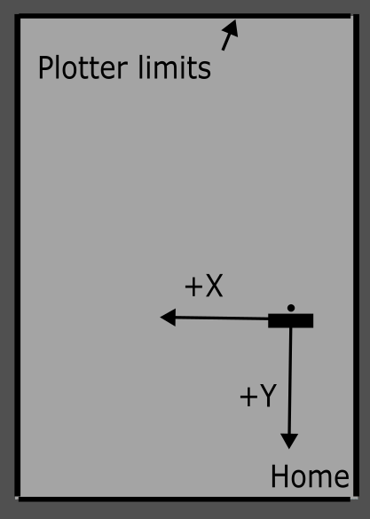

# Hardware Notes

## 2026-08-03 - Direction axes

Context:
- Test action: press `Center` after `Home`.
- Center command currently sends a relative move of +100 mm in X and -100 mm in Y.
- Initial position before test: carriage manually placed near center.

Observed behavior (user validation on machine):
- Home reference zone is in the bottom-right area.
- Axis mapping validated with jog tests:
  - `+X` moves the carriage to the left
  - `+Y` moves the carriage toward `Home` (down on the frame view)

Interpretation to keep for adjustments:
- Positive X currently maps to motion toward the left.
- Positive Y currently maps to motion toward the operator (down in the frame representation).

Center implication:
- From `Home` (bottom-right), an inward safe test move is `+X` and `-Y`.
- This matches the current `Center` implementation (`+100 X`, `-100 Y`).

Practical impact:
- Do not assume a "math-style" axis orientation for this machine.
- Any helper motion (centering, safe offsets, edge avoidance checks) must use this observed orientation.
- Before changing signs in motion helpers, validate again on hardware with a short move (for example 10 mm).
